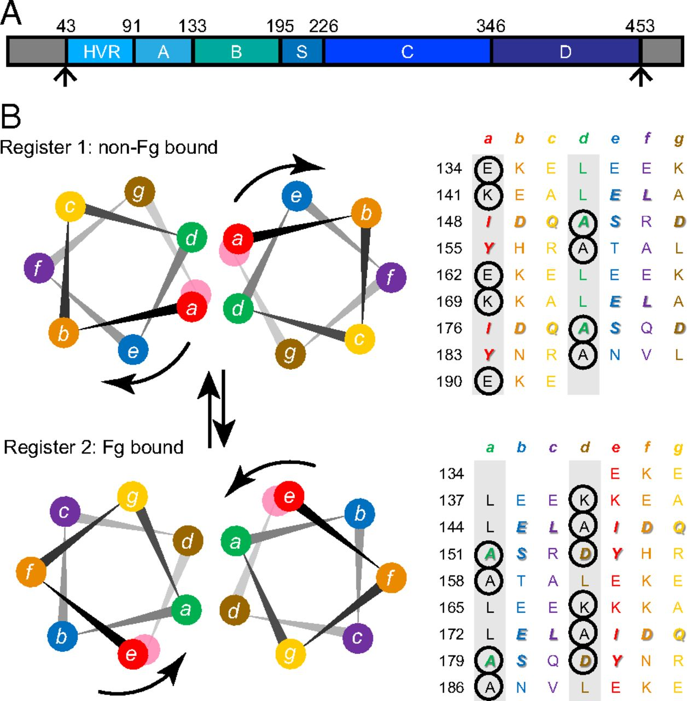

Brief Introduction to Protein Structure
=======================================

Proteins are crucial for our body and they carry out numerous roles within biological processes such as, transporting molecules, 
catalysing metabolic reactions, gene expression, DNA replication, cellular comminuciation, molecular recognition, etc.

If we look at the hierarchy of protein structure, we will encounter different levels, the first level of this hierarchy which is called 
**primary structure** consist of amino acids sequence in polypeptide chain.

The second level of this hierarchy called **secondary structure** which is any regular, repeating pattern of folding within the molecule.
Secondary structure can be divided three types which we can call α-helix, ß-sheet and coils.Also, these types can generate another form of protein that is called *SuperSecondary Structure*. Examples include β-hairpins, α-helix hairpins, and β-α-β motifs and Coiled Coil motifs.

**Coiled Coil** structures contain two or more α-helices . If the distance between two α-helices is less than 25 nucleotides, they will bound together and enclose each other. This supersecondary form of protein is called coiled-coil.Examples of proteins with coiled coil regions include myosins, tropomyosins and intermediate filaments.

	

The third level of this hierarchy called **tertiary structure** that is three-dimensional structure of a protein.There are two different types of tertiary structure of a protein; globular and fibrous.

The fourth level of this hierarchy called  **quaternary structure** which is contain multiple polypeptide chains and interacting with one another as noncovalently.

